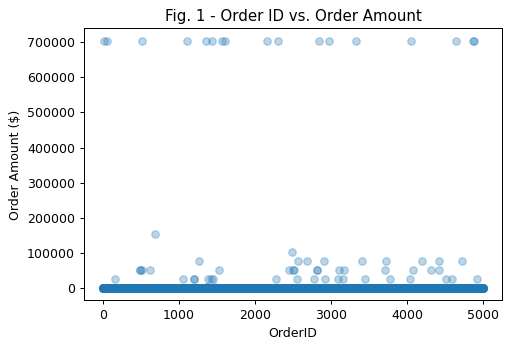

# <strong>Shopify Fall '21 Data Science Challenge</strong>

Link to the challenge: https://docs.google.com/document/d/13VCtoyto9X1PZ74nPI4ZEDdb8hF8LAlcmLH1ZTHxKxE/edit#

# Question 1:

### Given some sample [data](https://docs.google.com/spreadsheets/d/16i38oonuX1y1g7C_UAmiK9GkY7cS-64DfiDMNiR41LM/edit#gid=0), write a program to answer the following:

### On Shopify, we have exactly 100 sneaker shops, and each of these shops sells only one model of shoe. We want to do some analysis of the average order value (AOV). When we look at orders data over a 30 day window, we naively calculate an AOV of $3145.13. Given that we know these shops are selling sneakers, a relatively affordable item, something seems wrong with our analysis.

### a). Think about what could be going wrong with our calculation. Think about a better way to evaluate this data.

### b). What metric would you report for this dataset?

### c). What is its value?

# Analysis:

The AOV is calculated on unfiltered data and yields
the value of $3145.13. Due to such a high value, order amounts are investigated visually on a plot to get an understanding for its distribution.

From examining Fig. 1 Order ID vs. Order Amount plot, it can be seen that a few orders are around $700,000 for the order amount. In addition, some orders around roughly $50,000 average also exist as seen in the plot. To confirm that these orders are bulk orders and not erroneous data, an Order Amount vs. Total Items plot is created.

From Fig. 2 Total Items Per Order vs. Order Amount plot, it can be seen that two groups of data points exist; one on the low range of total items and one around roughly 2000 items. It seems strange that some orders where total items per order are low are totalling up to roughly $100,000 or more. Closer examination is done by plotting the same plot, but with custom x and y-axis ranges so as to narrow in on such data points.

From looking at Fig. 3 Total Items Per Order vs. Order Amount plot concentrating on the
data points with lower Total Items Per Order values, it can be seen that several data points with a low Order Amount exist while
a few data points seem to be going up in Order Amount linearly with respect to Total Items per Order.
This linear relationship could perhaps be one shoe shop selling a very expensive shoe
and getting multiple orders of varying quantities. Or, it could be erroneous data from a shoe shop.

But first, we examine the data points in the lowest Order Amount range ( lets say, <$5000) to ensure that these points don't seem erroneous.

These data points appear normal. Order amount goes up with No. of items ordered and the cost seems within reasonable range.

Now, to determine the meaning of the data points that have incredibly high Order Amount to No. of items ratio (ie. cost of each shoe) as found from examining Fig.3 Total Items Per Order vs. Order Amount plot,
we create a data frame (dataset) that holds these points only and see how many unique shops are involved.

No. of orders of such "expensive" shoes is determined to be 46.
Furthermore, only one shop seems to be selling these shoes. The shop is identified by its shop ID = 78.
The calculated shoe price at shop 78 is $25,725.

# Answers to Question 1 and Further Analysis:

A)
From the analysis above, calculating AOV on the original unfiltered data by averaging the
total_amount column (yielding $3145.13) is not ideal due to two apparent clusters of data
(regular/usual orders that would yield sensible AOV vs. bulk orders that amount to much greater Order Amounts). In addition, a very small fraction of data points are an anomaly in the data set ("expensive" shoes
of shop_id 78; whether by actual product price, or erroneous data) that are not representative of
the full dataset and significantly affect AOV as well.

B)
Thus, calculation of two AOVs are proposed; one for normal/regular orders, and one for bulk; both
omitting data concerning shop with shop ID = 78.

C)
The AOV for usual orders was calculated to be $302.58.
The AOV for bulk orders was calculated to be $704,000.00.

# Question 2:

### For this question you’ll need to use SQL. [Follow this link](https://www.w3schools.com/SQL/TRYSQL.ASP?FILENAME=TRYSQL_SELECT_ALL) to access the data set required for the challenge. Please use queries to answer the following questions. Paste your queries along with your final numerical answers below.

### A) How many orders were shipped by Speedy Express in total?

### B) What is the last name of the employee with the most orders?

### C) What product was ordered the most by customers in Germany?

# Answers to Question 2

A)
SELECT COUNT(\*) FROM Orders WHERE ShipperID=(SELECT ShipperID FROM Shippers WHERE ShipperName="Speedy Express");

The above is a nested SQL statement where ShipperID from Shippers table is identified in the sub-query, then passed into super-query that calculates and displays Count of orders with such Shipper ID.

54 orders were shipped by Speedy Express.

B)
SELECT _
FROM Orders
GROUP BY EmployeeID
ORDER BY COUNT(_) DESC
LIMIT 1;

The above query is used to identify employee ID with the most orders. EmployeeID field is grouped by COUNT and ordered from highest to lowest, with only the highest being outputted.
The query is then nested into a query getting employee name given EmployeeID using Employees table. The result is as follows:

SELECT LastName FROM Employees WHERE EmployeeID=(SELECT EmployeeID
FROM Orders
GROUP BY EmployeeID
ORDER BY COUNT(\*) DESC
LIMIT 1);

The last name of the employee with the most orders is Peacock.

C) SELECT ProductID, SUM(Quantity)
FROM OrderDetails
GROUP BY ProductID
ORDER BY SUM(Quantity) DESC
LIMIT 1;

The above query sums the Quantity field while grouping by ProductID, in effect yielding a table where Product IDs are uniquely listed alongside summed Quantity field. The last two lines of the query sort the table rows by greatest quantity first, and only showing the first entry. The query is then nested into a query that returns product name given ProductID using Products table. The result is as follows:

SELECT ProductName FROM Products WHERE ProductID = (SELECT ProductID FROM (
SELECT ProductID, SUM(Quantity)
FROM OrderDetails
GROUP BY ProductID
ORDER BY SUM(Quantity) DESC
LIMIT 1))

The product ordered the most by customers in Germany is Gorgonzola Telino.
